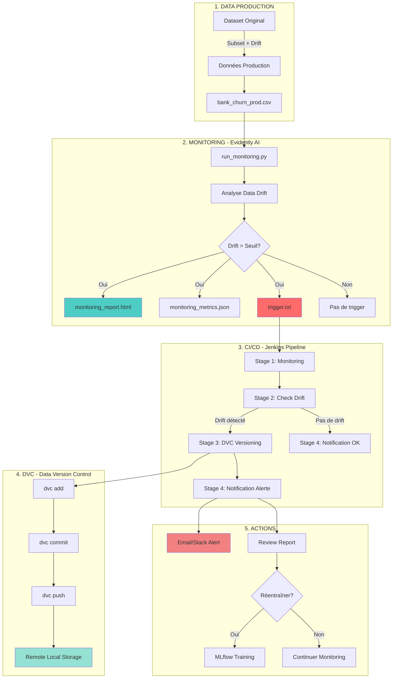

# Pipeline MLOps Complet - Architecture et Workflow

## 🎯 Vue d'Ensemble

Ce document décrit l'architecture complète du pipeline MLOps pour le projet Bank Churn Prediction, incluant le monitoring automatisé, la détection de drift, et le versioning des données.

## 📊 Architecture du Pipeline



## 🔄 Flux de Données Détaillé

### Phase 1: Génération des Données de Production

1. **Script**: `scripts/generate_prod_data.py`
2. **Input**: `data/churn.csv` (lignes 20000-30000)
3. **Transformations**:
   - Drift sur Balance (+20%)
   - Drift sur Credit Score (-15 points)
   - Drift sur Income (+10%)
   - Drift sur Churn Rate (+4.5%)
4. **Output**: `data/production/bank_churn_prod.csv`

### Phase 2: Monitoring avec Evidently

1. **Script**: `monitoring/run_monitoring.py`
2. **Comparaison**:
   - Référence: `data/churn.csv`
   - Production: `data/production/bank_churn_prod.csv`
3. **Analyses**:
   - Data Drift (distribution changes)
   - Data Quality (missing values, types)
   - Statistical tests (KS, Chi-squared)
4. **Outputs**:
   - `monitoring_report.html` (rapport interactif)
   - `monitoring_metrics.json` (métriques exportées)
   - `trigger.txt` (si drift > 0.1)

### Phase 3: Pipeline Jenkins

#### Stage 1: Data Drift Monitoring
```groovy
bat "${PYTHON_ENV} monitoring/run_monitoring.py"
archiveArtifacts 'monitoring/*.html, monitoring/*.json'
publishHTML reportName: 'Evidently Data Drift Report'
```

#### Stage 2: Check Data Drift
```groovy
def triggerExists = fileExists('trigger.txt')
if (triggerExists) {
    env.DRIFT_DETECTED = 'true'
    currentBuild.result = 'UNSTABLE'
}
```

#### Stage 3: DVC Versioning (conditionnel)
```groovy
when { expression { env.DRIFT_DETECTED == 'true' } }
steps {
    bat "dvc add data/production/bank_churn_prod.csv"
    bat "git add *.dvc"
    bat "dvc push"
}
```

#### Stage 4: Notification
```groovy
if (env.DRIFT_DETECTED == 'true') {
    // Alertes email/Slack
    emailext subject: "Data Drift Detected"
}
```

### Phase 4: DVC Versioning

1. **Initialisation**: `dvc_setup.bat`
2. **Configuration**:
   ```bash
   dvc init
   dvc remote add -d local_storage ./dvc_storage
   ```
3. **Versioning**:
   ```bash
   dvc add data/production/bank_churn_prod.csv
   git add data/production/bank_churn_prod.csv.dvc
   git commit -m "DVC: Version après drift"
   dvc push
   ```

## 📁 Structure des Fichiers

```
MLOps_Bank_Churn/
├── data/
│   ├── churn.csv                          # Données d'entraînement (référence)
│   └── production/
│       ├── bank_churn_prod.csv            # Données de production
│       └── bank_churn_prod.csv.dvc        # Métadonnées DVC
├── monitoring/
│   ├── run_monitoring.py                  # Script Evidently
│   ├── monitoring_report.html             # Rapport HTML (généré)
│   ├── monitoring_metrics.json            # Métriques JSON (généré)
│   └── requirements.txt                   # evidently, pandas, numpy
├── jenkins/
│   ├── Jenkinsfile                        # Pipeline déclaratif
│   └── README.md                          # Documentation Jenkins
├── scripts/
│   └── generate_prod_data.py              # Génération données production
├── dvc_storage/                           # Remote local DVC
├── .dvc/                                  # Configuration DVC
├── dvc_setup.bat                          # Script init DVC (Windows)
├── dvc_setup.sh                           # Script init DVC (Linux/Mac)
└── trigger.txt                            # Fichier trigger (si drift)
```

## 🚀 Guide d'Utilisation

### Étape 1: Générer les Données de Production

```bash
python scripts/generate_prod_data.py
```

**Output**: `data/production/bank_churn_prod.csv` (10,000 lignes avec drift)

### Étape 2: Exécuter le Monitoring

```bash
python monitoring/run_monitoring.py
```

**Outputs**:
- `monitoring/monitoring_report.html`
- `monitoring/monitoring_metrics.json`
- `trigger.txt` (si drift détecté)

### Étape 3: Consulter les Résultats

```bash
# Ouvrir le rapport HTML
start monitoring/monitoring_report.html

# Lire les métriques JSON
cat monitoring/monitoring_metrics.json

# Vérifier le trigger
if exist trigger.txt (type trigger.txt)
```

### Étape 4: Initialiser DVC

```bash
# Windows
dvc_setup.bat

# Linux/Mac
bash dvc_setup.sh
```

### Étape 5: Pipeline Jenkins (optionnel)

Si Jenkins est installé:
1. Créer un job Pipeline
2. Pointer vers `jenkins/Jenkinsfile`
3. Configurer le déclenchement (cron: `0 2 * * *`)
4. Lancer le build

## 📊 Métriques et Seuils

### Seuils de Drift

| Métrique | Seuil | Action |
|----------|-------|--------|
| Dataset Drift Score | > 0.1 | Créer trigger |
| Column Drift | > 0.1 | Logger colonne |
| Data Quality | < 0.95 | Warning |

### Métriques Surveillées

- **Balance**: Distribution, moyenne, écart-type
- **Credit Score**: Distribution, outliers
- **Income**: Distribution, tendance
- **Churn Rate**: Proportion, évolution

## 🔔 Notifications et Alertes

### Conditions de Déclenchement

1. **Drift Détecté** (drift_score > 0.1):
   - ✅ Créer `trigger.txt`
   - ✅ Marquer build Jenkins comme UNSTABLE
   - ✅ Envoyer notification
   - ✅ Archiver rapports

2. **Pas de Drift**:
   - ✅ Supprimer `trigger.txt`
   - ✅ Build SUCCESS
   - ✅ Continuer monitoring

### Canaux de Notification

- **Jenkins UI**: Console logs, rapports HTML
- **Email**: (à configurer dans Jenkinsfile)
- **Slack**: (à configurer avec webhook)
- **Fichier**: `trigger.txt` avec détails

## 🛠️ Maintenance et Troubleshooting

### Problèmes Courants

#### 1. Evidently non installé
```bash
pip install evidently
```

#### 2. DVC non initialisé
```bash
dvc init
dvc remote add -d local_storage ./dvc_storage
```

#### 3. Jenkins ne trouve pas Python
```groovy
// Dans Jenkinsfile
environment {
    PYTHON_ENV = "C:/path/to/python.exe"
}
```

#### 4. Pas de drift détecté (test)
```python
# Dans generate_prod_data.py
DRIFT_INTENSITY = 0.3  # Augmenter l'intensité
```

## 📈 Évolutions Futures

### Court Terme
- [ ] Ajouter plus de métriques (feature importance drift)
- [ ] Configurer email/Slack notifications
- [ ] Créer dashboard Grafana

### Moyen Terme
- [ ] Intégrer avec MLflow pour auto-retraining
- [ ] Ajouter tests A/B sur modèles
- [ ] Implémenter model decay detection

### Long Terme
- [ ] Migration vers cloud (S3, GCS)
- [ ] Kubernetes deployment
- [ ] Real-time drift detection

## 📚 Ressources

- [Evidently Documentation](https://docs.evidentlyai.com/)
- [DVC Documentation](https://dvc.org/doc)
- [Jenkins Pipeline](https://www.jenkins.io/doc/book/pipeline/)
- [MLOps Best Practices](https://ml-ops.org/)

## ✅ Checklist de Déploiement

- [x] Données de production générées
- [x] Script de monitoring créé
- [x] Pipeline Jenkins défini
- [x] DVC configuré
- [x] Documentation complète
- [ ] Jenkins installé et configuré
- [ ] Tests end-to-end réussis
- [ ] Notifications configurées
